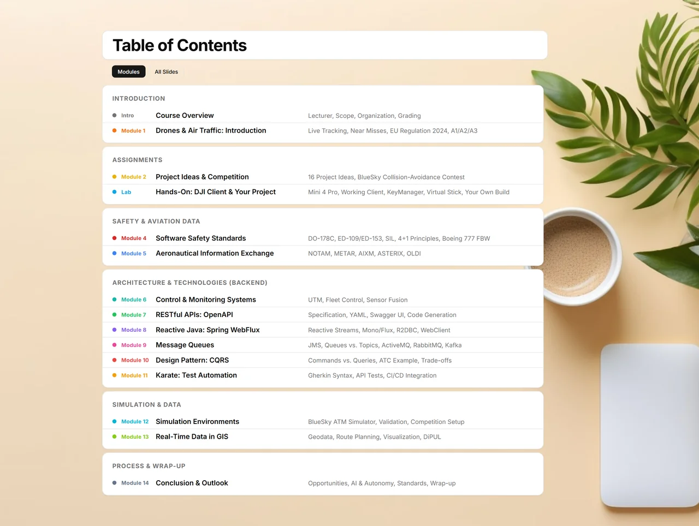

# Innovative Technologies for Drones<br><sub>Air Traffic Modeling</sub>

University lecture slides — elective master module (WPM), Albstadt-Sigmaringen University of Applied Sciences. Introduction, 14 modules, a hands-on DJI drone lab and a [BlueSky](https://github.com/TUDelft-CNS-ATM/bluesky) collision-avoidance competition.




## Quick Start

No build step needed — slides load JSON at runtime.

**Auto-reload** (browser refreshes on every file change):
```bash
cd slides
npx live-server --port=3000
```
Open `http://localhost:3000`

## Navigation

| Key | Action |
|-----|--------|
| `→` / `Space` / `PageDown` | Next slide |
| `←` / `Backspace` / `PageUp` | Previous slide |
| `Home` | First slide |
| `End` | Last slide |
| `F` | Toggle fullscreen |
| Click slide counter | Jump to slide number |

## Project Structure

```
slides/
  index.html              ← lightweight shell (loads JS + CSS)
  css/
    style.css             ← presentation styles
  js/
    slides.js             ← runtime renderer: fetches JSON, builds slides in browser
    build-html.js         ← optional static build (Node.js fallback)
    drone.js              ← animated quadcopter for cover slides
  json/
    slides-config.json    ← metadata (title, modules, TOC, cover)
    module_0.json         ← Intro: Course Overview
    module_1.json         ← M1: Drones & Air Traffic: Introduction
    module_2.json         ← M2: Project Ideas & Competition
    module_3.json         ← Lab: DJI Client & Your Project (fly it, then build your own)
    module_4.json         ← M4: Software Safety Standards
    module_5.json         ← M5: Aeronautical Information Exchange
    module_6.json         ← M6: Control & Monitoring Systems (UTM)
    module_7.json         ← M7: RESTful APIs: OpenAPI
    module_8.json         ← M8: Reactive Java: Spring WebFlux
    module_9.json         ← M9: Message Queues
    module_10.json        ← M10: Design Pattern: CQRS
    module_11.json        ← M11: Karate: Test Automation
    module_12.json        ← M12: Simulation Environments (BlueSky)
    module_13.json        ← M13: Real-Time Data in GIS
    module_14.json        ← M14: Conclusion & Outlook
  images/
    bg/                   ← background images
    content/              ← slide content images (UTM diagram, METAR examples, etc.)
tools/
  export_pdf.py           ← export all slides to landscape PDF
  _animate_cover.py       ← record cover slide as animated WebP (README)
  _screenshot_toc.py      ← screenshot TOC slide to .github/toc.webp (README)
labs/
  dji-hello-world/        ← Module 3 lab: Android app that flies a DJI Mini 4 Pro
export/                   ← generated output (gitignored)
```

## Labs

Hands-on code that accompanies the lecture modules lives under `labs/`.

- **[`labs/dji-hello-world`](labs/dji-hello-world/)** — the working client behind the
  **Module 3 lab (DJI Client & Your Project)**. A minimal Android app that connects to
  a **DJI Mini 4 Pro** via the **RC-N3** and flies a fixed mission (take off → ~1.5 m
  forward → 180° turn → ~1.5 m back → land) using MSDK v5. It's the proof of concept
  students build their own project on top of. Setup, build, and a full troubleshooting
  log are in its own [README](labs/dji-hello-world/README.md).

## Editing Content

Edit the `json/module_*.json` files directly. Each file is a JSON array of slide objects.

Slide types:
- **cover** — module title slide with badges and contents sidebar
- **content** — teaching slide with body elements (cards, code, tables, quotes, images)

Cover navigation links are computed automatically at runtime.

## PDF Export

```bash
pip install playwright pypdf
playwright install chromium
python tools/export_pdf.py
```
Output: `export/slides.pdf` (landscape)

## Dependencies

- Node.js (for `npx live-server`)
- PDF export: Python 3, playwright, pypdf
- README asset regeneration: Python 3, playwright, Pillow, ffmpeg

## License

[CC BY 4.0](https://creativecommons.org/licenses/by/4.0/) — see [LICENSE](LICENSE).
Copyright © 2026 Dennis Piskovatskov.
