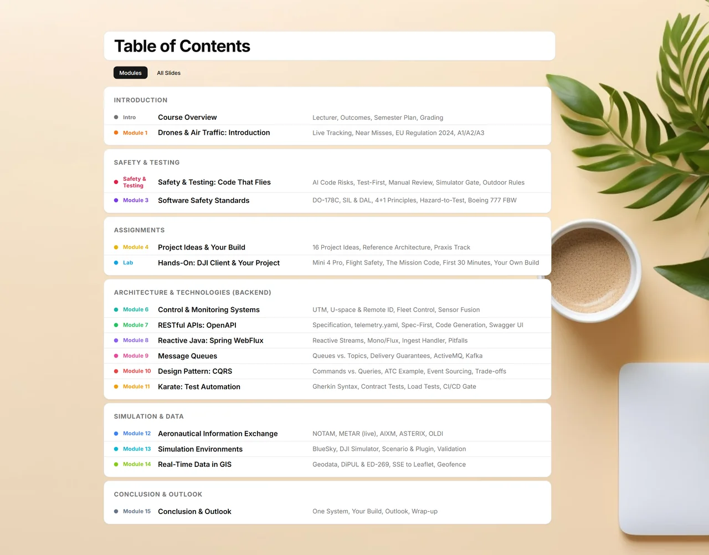

# Innovative Technologies for Drones<br><sub>Air Traffic Modeling</sub>

University lecture slides — elective master module (WPM), Albstadt-Sigmaringen University of Applied Sciences. Intro plus 15 modules: a safety-and-testing gate, a hands-on DJI drone lab, the backend technology stack, and validation in the [BlueSky](https://github.com/TUDelft-CNS-ATM/bluesky) ATM simulator.




## How the Deck Is Built

- **One system, module by module.** Every module is a station of the same reference pipeline —
  DJI Mini 4 Pro → Android client (M5) → OpenAPI contract (M7) → WebFlux ingest (M8) →
  telemetry topic (M9) → CQRS store (M10) / live map (M14) / avoidance logic validated in
  BlueSky (M13), fed by NOTAM · METAR · AIXM (M12), inside a UTM picture (M6), contract-tested
  with Karate (M11), guarded by the Safety & Testing gate (M2) and the DO-178C mindset (M3).
  The diagram appears in the intro and is revisited in M15.
- **One contract.** `telemetry.yaml` (M7) defines the `Fix` every later module reuses: the Android
  client posts it, the ingest handler validates it, the topic fans it out, the map draws it,
  Karate tests it.
- **Same skeleton in every module:** why it matters for the drone → concept → real code or data →
  exercise → takeaway. Code slides show real artifacts (the lab's mission code, a BlueSky
  scenario and plugin, a live METAR call), not illustrations.
- **One graded deliverable:** a working increment on the lab client, defended at a live demo.
  Ideas, milestones and the grading bar are in M4; the safety gate every flight passes is M2.

**Before each semester**, fill the placeholders marked `[date]` and `[__ %]` in
`module_0.json` (semester plan, grading weights) and `module_4.json` (milestone dates).

## Quick Start

No build step needed — slides load JSON at runtime.

**Auto-reload** (browser refreshes on every file change):
```bash
cd slides
npx live-server --port=3000
```
Open `http://localhost:3000`

## Navigation

| Key | Action |
|-----|--------|
| `→` / `Space` / `PageDown` | Next slide |
| `←` / `Backspace` / `PageUp` | Previous slide |
| `Home` | First slide |
| `End` | Last slide |
| `F` | Toggle fullscreen |
| Click slide counter | Jump to slide number |
| Click any content image | Enlarge in a lightbox (`Esc` closes) |

**Deep links** — the URL hash addresses slides by module: `#2` opens the Safety & Testing
cover, `#5` the Lab, `#2.3` the 3rd content slide of module 2, `#toc` the table of contents.
The hash updates as you navigate, so sharing the current slide is copy-the-URL.

## Project Structure

```
slides/
  index.html              ← lightweight shell (loads JS + CSS)
  css/
    style.css             ← presentation styles
  js/
    slides.js             ← runtime renderer: fetches JSON, builds slides in browser
    build-html.js         ← optional static build (Node.js fallback)
    drone.js              ← animated quadcopter for cover slides
  json/
    slides-config.json    ← metadata (title, modules, TOC, cover)
    module_0.json         ← Intro: outcomes, semester plan, grading
    module_1.json         ← M1: Drones & Air Traffic — incidents, EU 2019/947, A1/A2/A3
    module_2.json         ← M2: Safety & Testing — the gate before anything flies
    module_3.json         ← M3: Software Safety Standards — DO-178C, DAL, 4+1 principles
    module_4.json         ← M4: Project Ideas & Your Build — 16 ideas, milestones, grading bar
    module_5.json         ← M5: Lab — DJI client, the mission code, your own build
    module_6.json         ← M6: Control & Monitoring Systems — UTM, U-space, fleet control
    module_7.json         ← M7: RESTful APIs: OpenAPI — telemetry.yaml, the course contract
    module_8.json         ← M8: Reactive Java: Spring WebFlux — ingest handler, pitfalls
    module_9.json         ← M9: Message Queues — topics, delivery guarantees, Kafka
    module_10.json        ← M10: Design Pattern: CQRS — plus event sourcing
    module_11.json        ← M11: Karate: Test Automation — contract tests, load test, CI gate
    module_12.json        ← M12: Aeronautical Information Exchange — NOTAM, METAR (live), AIXM, ASTERIX, OLDI
    module_13.json        ← M13: Simulation Environments — BlueSky scenario & plugin
    module_14.json        ← M14: Real-Time Data in GIS — DiPUL/ED-269, SSE to Leaflet, geofence
    module_15.json        ← M15: Conclusion & Outlook — the system revisited
  images/
    bg/                   ← background images
    content/              ← slide content images (UTM diagram, METAR examples, etc.)
tools/
  export_pdf.py           ← export all slides to landscape PDF
  _animate_cover.py       ← record cover slide as animated WebP (README)
  _screenshot_toc.py      ← screenshot TOC slide to .github/toc.webp (README)
labs/
  dji-hello-world/        ← Module 5 lab: Android app that flies a DJI Mini 4 Pro
export/                   ← generated output (gitignored)
```

## Labs

Hands-on code that accompanies the lecture modules lives under `labs/`.

- **[`labs/dji-hello-world`](labs/dji-hello-world/)** — the working client behind the
  **Module 5 lab (DJI Client & Your Project)**. A minimal Android app that connects to
  a **DJI Mini 4 Pro** via the **RC-N3** and flies a fixed mission (take off → ~1.5 m
  forward → 180° turn → ~1.5 m back → land) using MSDK v5. It's the proof of concept
  students build their own project on top of. Setup, build, and a full troubleshooting
  log are in its own [README](labs/dji-hello-world/README.md).

## Editing Content

Edit the `json/module_*.json` files directly. Each file is a JSON array of slide objects.

Slide types:
- **cover** — module title slide with badges and contents sidebar
- **content** — teaching slide with body elements (cards, code, tables, quotes, images, resource links)

Content slides carry an optional `tag` that renders as a badge: `safety`, `important`, `demo`,
`exercise`, `mistake`, `industry`, `takeaway`. Code blocks use `<span class="kw">` / `<span class="str">`
for highlighting and an optional `note` below the block; tables accept an optional `note` too.

Cover navigation links and the table of contents (`tocGroups` / `toc` in `slides-config.json`)
are computed automatically at runtime.

## PDF Export

```bash
pip install playwright pypdf
playwright install chromium
python tools/export_pdf.py
```
Output: `export/slides.pdf` (landscape)

## Dependencies

- Node.js (for `npx live-server`)
- PDF export: Python 3, playwright, pypdf
- README asset regeneration: Python 3, playwright, Pillow, ffmpeg

## License

[CC BY 4.0](https://creativecommons.org/licenses/by/4.0/) — see [LICENSE](LICENSE).
Copyright © 2026 Dennis Piskovatskov.
